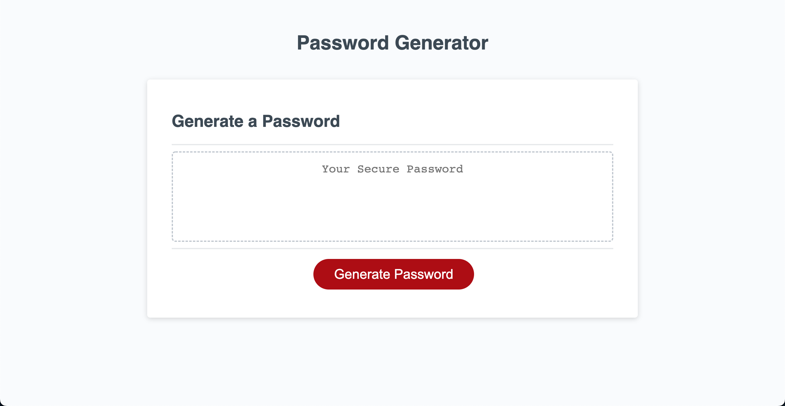

# Random Password Generator

The purpose of this application is to create genuinely random passwords based on the selected criteria of the user. These passwords must be between 8 and 128 characters, and the user also has the ability to include or leave out different character types.

The following picture shows the visual of the application.

## Built With

- HTML
- CSS
- JavaScript

### Website

https://tguy5837.github.io/pw-generator/

### GitHub Repository

https://github.com/tguy5837/pw-generator

## Contribution

Created by Taylor Guy
